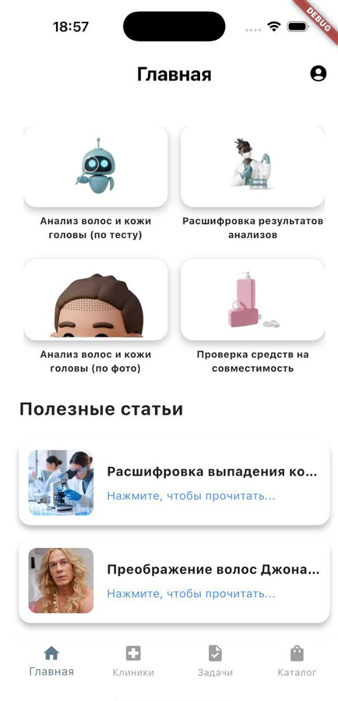
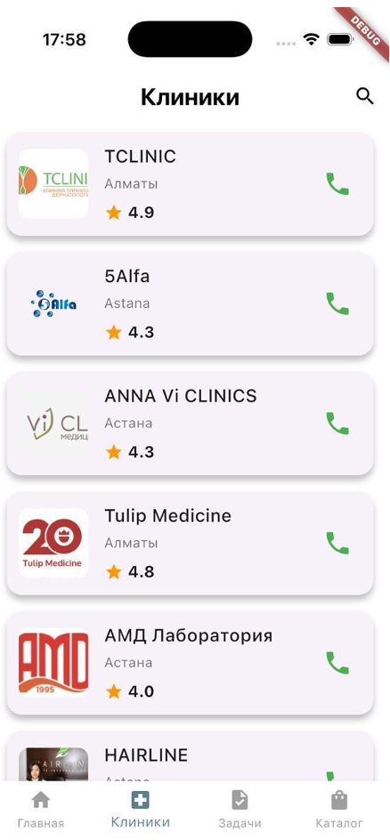
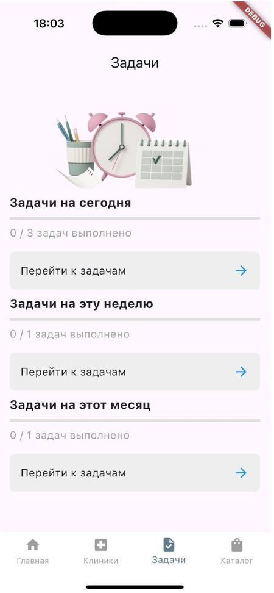
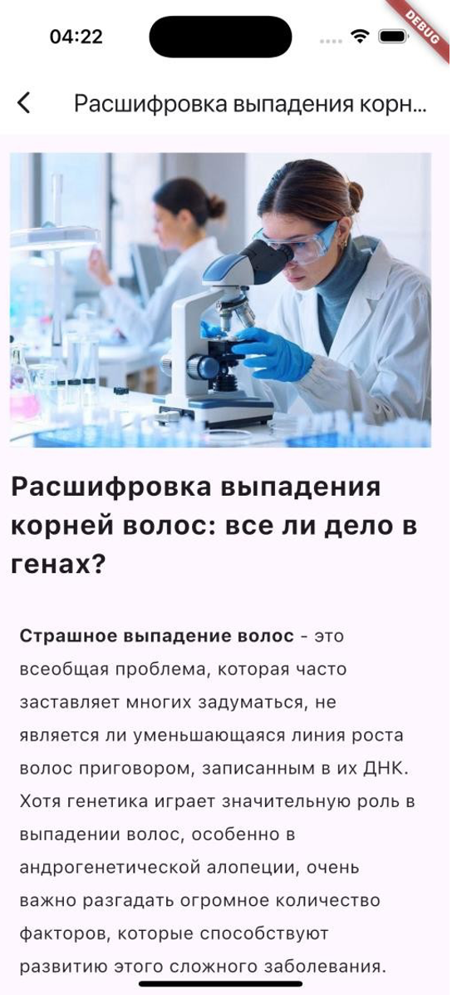
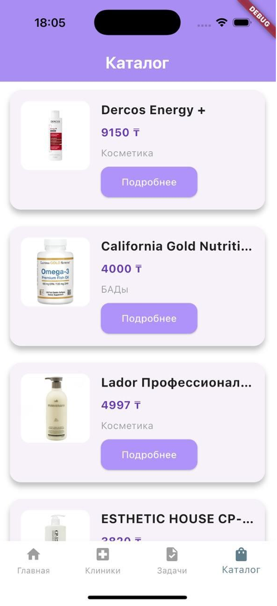
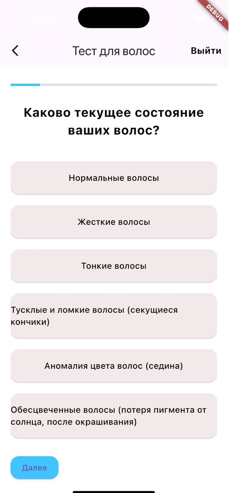
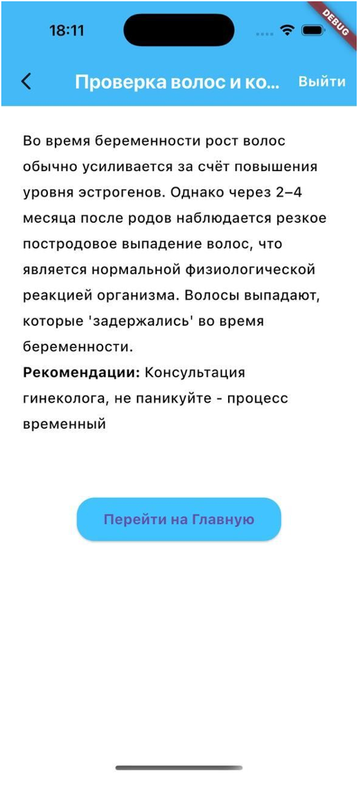
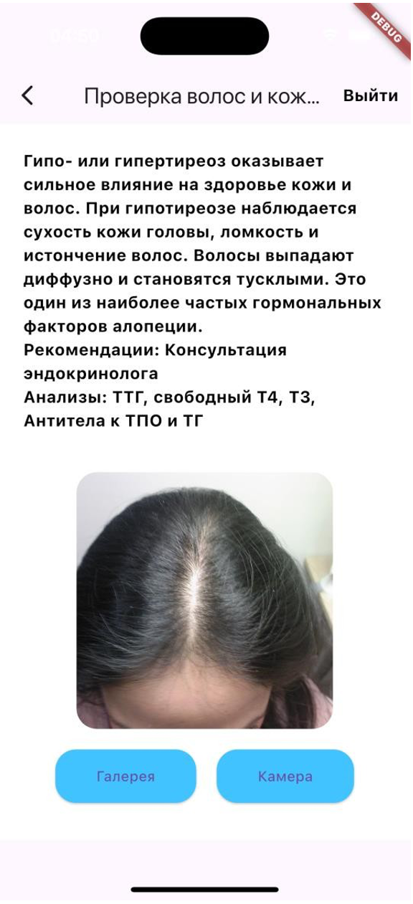
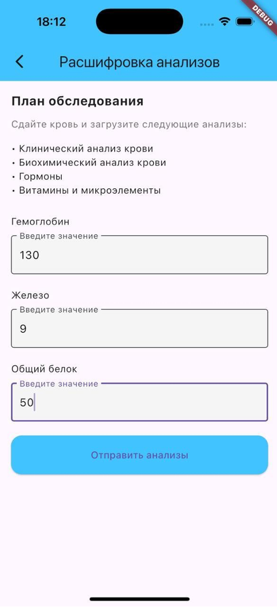
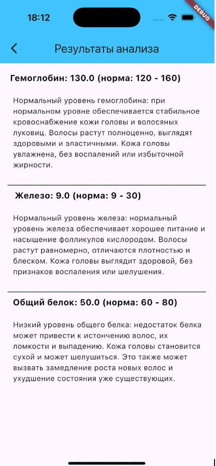

# 💇‍♀️ Aidarium

[](https://flutter.dev/) [](LICENSE)

**Aidarium** — это умное мобильное приложение для анализа состояния волос, кожи головы и результатов анализов крови.  
Оно сочетает машинное обучение, медицинские знания и персональные рекомендации для улучшения здоровья и внешности.

---

## 📋 Оглавление
- [Скриншоты](#-views)
- [Экран с тестом](#-экран-с-тестом-для-определения-состояния-волос-и-кожи-головы)
- [Анализ головы с фото](#-анализ-головы-с-помощью-фото)
- [Анализ крови](#-анализ-крови)
- [Функциональность](#-функциональность)
- [Технологии](#-технологии)
- [Требования](#-требования)
- [Установка](#-установка)
- [Тестирование](#-тестирование)
- [В планах](#-в-планах)
- [Контрибьютинг](#-контрибьютинг)
- [Лицензия](#-лицензия)

---

## 📦 Требования
- Flutter 3.10+
- Dart 3.0+
- Android 8.0+ / iOS 13+
- Аккаунт Firebase

---

## 📸 Views

| Главный экран | Клиники | Задачи | Новости | Каталог |
|:---:|:---:|:---:|:---:|:---:|
|  |  |  |  |  |

---

## 📸 Экран с тестом для определения состояния волос и кожи головы

| Тест | Результат |
|:---:|:---:|
|  |  |

---

## 📸 Анализ головы с помощью фото

| Фото | Результат |
|:---:|:---:|
|  |  |

---

## 📸 Анализ крови

| Анализ | Результат |
|:---:|:---:|
|  |  |

---

## 🚀 Функциональность

- 📷 Загрузка фото кожи головы и волос
- 🤖 Анализ изображений с помощью Roboflow (CNN)
- 🧠 Определение состояния: жирность, перхоть, истончение и др.
- 🩸 Анализ крови: гемоглобин, лейкоциты и другие показатели
- 📊 История анализов и отслеживание динамики
- 📚 Раздел со статьями: уход, здоровье, питание, диагностика
- 🏥 Каталог клиник и медцентров
- 🛍 Каталог средств по уходу: шампуни, маски, масла и т.п.
- 🔐 Авторизация через Firebase
- ☁ Хранение результатов и изображений в Firestore/Storage

---

## 🛠 Технологии

- **Flutter + Dart** — кроссплатформенная разработка
- **Firebase** — Auth, Firestore, Storage
- **Roboflow** — машинное обучение (CNN)
- **REST API** — для передачи и получения анализа
- **Provider** — управление состоянием
- **TensorFlow Lite** — (возможно в будущем)
- **VS Code** — среда разработки

---

## 📦 Установка

1. Клонируй репозиторий:
   ```bash
   git clone https://github.com/25angel/aidarium.git
   cd aidarium
   ```
2. Установи зависимости:
   ```bash
   flutter pub get
   ```
3. Настрой Firebase:
   - Создай проект на [https://console.firebase.google.com](https://console.firebase.google.com)
   - Добавь Android/iOS-приложения
   - Скачай и помести:
     - `google-services.json` → `android/app/`
     - `GoogleService-Info.plist` → `ios/Runner/`
4. Запусти приложение:
   ```bash
   flutter run
   ```

---

## 🧪 Тестирование

Для запуска тестов:
```bash
flutter test
```

---

## 📝 В планах

- 📈 Графики и сравнение анализа по неделям/месяцам
- 🧬 ИИ-рекомендации по уходу и лечению
- 🌐 Синхронизация с Google Fit / Apple Health
- 📲 Интеграция с онлайн-консультациями

---

## 🤝 Контрибьютинг

Проект в разработке. Pull requests, feedback и идеи приветствуются!

---

## 📄 Лицензия

MIT
